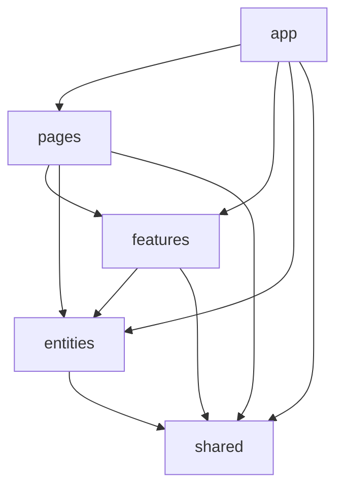

# Feature Sliced Design（FSD）アーキテクチャガイド

## 概要

このプロジェクトでは**Feature Sliced Design（FSD）**アーキテクチャを採用し、コードの保守性・拡張性・可読性を最大化しています。FSDは、大規模なフロントエンドアプリケーションの複雑性を管理するための現代的なアーキテクチャパターンです。

## FSDの基本原則

### 📁 層構造（Layers）

FSDでは、コードを以下の層に分類します：

```
src/
├── app/        # アプリケーション初期化・グローバル設定
├── pages/      # ページコンポーネント（ルーティング対応）
├── features/   # ビジネス機能（ChatSystem, ImageGenerator等）
├── entities/   # ドメインモデル（User, Post, Comment等）
└── shared/     # 共通リソース（純粋なライブラリ・ユーティリティ）
```

### 🎯 各層の責務

| 層           | 責務                                   | 具体例                                              |
| ------------ | -------------------------------------- | --------------------------------------------------- |
| **app**      | アプリケーション初期化・グローバル状態 | ルーティング、プロバイダー、グローバルStore         |
| **pages**    | 画面コンポーネント                     | HomePage, ProfilePage, ChatPage                     |
| **features** | ビジネス機能・ユースケース             | チャット機能、画像生成機能、認証機能                |
| **entities** | ドメインモデル・エンティティ           | User, Post, Comment, Product                        |
| **shared**   | 汎用ライブラリ・共通リソース           | UI コンポーネント、API クライアント、ユーティリティ |

### 📦 セグメント（Segments）

各層内で、さらに責務別にセグメントを分けます：

```
[layer]/[slice]/
├── api/     # サーバーとの通信・外部API
├── model/   # 状態管理・ビジネスロジック・型定義
├── lib/     # ライブラリ・ユーティリティ
└── ui/      # UIコンポーネント
```

## 📐 依存関係のルール

### ✅ 許可される依存関係



**原則**: 上位層は下位層に依存できるが、下位層は上位層に依存してはいけない

### ❌ 禁止される依存関係

- `shared` → `entities` 依存（sharedは純粋であるべき）
- `entities` → `features` 依存（エンティティは機能に依存しない）
- 同一層内での横断的依存（例：feature A → feature B）

## 🏗️ 実装パターン

### 1. **Shared層の設計**

#### API クライアント

```typescript
// src/shared/server/openai.server.ts
export async function createOpenAIInstance(): Promise<OpenAI> {
  'use server'
  // 純粋なAPIクライアント実装
}
```

#### 共通UIコンポーネント

```typescript
// src/shared/ui/button.tsx
export function Button({ children, ...props }: ButtonProps) {
  // 汎用的なButtonコンポーネント
}
```

#### ユーティリティ

```typescript
// src/shared/lib/utils.ts
export function cn(...inputs: ClassValue[]) {
  // 汎用的なユーティリティ関数
}
```

### 2. **Entities層の設計**

#### ユーザーエンティティ

```typescript
// src/entities/user/model/types.ts
export interface User {
  id: string
  email: string
  name: string
  avatar?: string
}
```

```typescript
// src/entities/user/api/getUser.ts

// クライアントサイド実装（基本・推奨）
'use client'
import { pb } from '@/shared/lib/pocketbase'

export async function getUserAction(userId: string): Promise<User | null> {
  return await pb.collection('users').getOne(userId)
}

// Server Functions実装（管理者権限が必要な場合）
;('use server')
import { createPocketBaseInstance } from '@/shared/server/pocketbase.server'

export async function getUserAdminAction(userId: string): Promise<User | null> {
  const pb = await createPocketBaseInstance()
  return await pb.collection('users').getOne(userId)
}
```

```typescript
// src/entities/user/lib/validation.ts
import { z } from 'zod'

export const userSchema = z.object({
  email: z.string().email(),
  name: z.string().min(1),
})
```

### 3. **Features層の設計**

#### チャット機能

```typescript
// src/features/chat/model/types.ts
export interface ChatMessage {
  id: string
  content: string
  userId: string
  createdAt: Date
}
```

```typescript
// src/features/chat/api/sendMessage.ts
'use server'
import { createOpenAIInstance } from '@/shared/server/openai.server'
import { getUserAction } from '@/entities/user/api/getUser'

export async function sendChatMessageAction(content: string, userId: string) {
  // 1. ユーザー検証（entities層を利用）
  const user = await getUserAction(userId)
  if (!user) throw new Error('ユーザーが見つかりません')

  // 2. AI処理（shared層を利用）
  const openai = await createOpenAIInstance()
  const response = await openai.chat.completions.create({
    model: 'gpt-5',
    messages: [{ role: 'user', content }],
  })

  // 3. ビジネスロジック
  return {
    userMessage: { content, userId, createdAt: new Date() },
    aiResponse: response.choices[0]?.message?.content || '',
  }
}
```

```typescript
// src/features/chat/ui/ChatInterface.tsx
import { Button } from '@/shared/ui/button'
import { sendChatMessageAction } from '../api/sendMessage'

export function ChatInterface() {
  // チャット機能固有のUI実装
}
```

### 4. **Pages層の設計**

```typescript
// src/pages/ChatPage/ui/ChatPage.tsx
import { ChatInterface } from "@/features/chat/ui/ChatInterface";
import { UserProfile } from "@/entities/user/ui/UserProfile";

export function ChatPage() {
  return (
    <div>
      <UserProfile /> {/* entities層のUI */}
      <ChatInterface /> {/* features層のUI */}
    </div>
  );
}
```

## 🔧 開発パターン

### **新機能追加の手順**

#### Step 1: エンティティの定義（必要に応じて）

```typescript
// src/entities/post/model/types.ts
export interface Post {
  id: string
  title: string
  content: string
  authorId: string
}
```

#### Step 2: 機能の実装

```typescript
// src/features/blog-editor/api/createPost.ts

// クライアントサイド実装（基本・推奨）
'use client'
import { pb } from '@/shared/lib/pocketbase'

export async function createPostAction(postData: CreatePostData) {
  return await pb.collection('posts').create(postData)
}

// Server Functions実装（AIエージェントやバッチ処理の場合）
;('use server')
import { createPocketBaseInstance } from '@/shared/server/pocketbase.server'
import { Mastra } from 'mastra'

export async function createPostWithAIAction(postData: CreatePostData) {
  const pb = await createPocketBaseInstance()

  // AIでコンテンツを生成
  const mastra = new Mastra()
  const enhancedContent = await mastra.enhance(postData.content)

  return await pb.collection('posts').create({
    ...postData,
    content: enhancedContent,
  })
}
```

#### Step 3: UI の実装

```typescript
// src/features/blog-editor/ui/PostEditor.tsx
import { Button } from '@/shared/ui/button'
import { createPostAction } from '../api/createPost'

export function PostEditor() {
  // 投稿エディターのUI実装
}
```

#### Step 4: ページでの統合

```typescript
// src/pages/EditorPage/ui/EditorPage.tsx
import { PostEditor } from "@/features/blog-editor/ui/PostEditor";

export function EditorPage() {
  return <PostEditor />;
}
```

## 📋 ベストプラクティス

### ✅ DO（推奨事項）

1. **純粋性の維持**

   ```typescript
   // ✅ shared層は純粋
   // src/shared/lib/dateUtils.ts
   export function formatDate(date: Date): string {
     return date.toISOString().split('T')[0]
   }
   ```

2. **責務の明確化**

   ```typescript
   // ✅ entities: データモデルに特化
   // src/entities/user/model/user.ts
   export interface User {
     /* ... */
   }

   // ✅ features: ビジネスロジックに特化
   // src/features/authentication/api/login.ts
   export async function loginAction() {
     /* ... */
   }
   ```

3. **インデックスファイルでのエクスポート**
   ```typescript
   // src/entities/user/index.ts
   export { type User } from './model/types'
   export { getUserAction } from './api/getUser'
   export { UserProfile } from './ui/UserProfile'
   ```

### ❌ DON'T（避けるべき事項）

1. **逆向き依存の禁止**

   ```typescript
   // ❌ shared層からentities層への依存
   // src/shared/lib/userUtils.ts
   import { User } from '@/entities/user' // 禁止
   ```

2. **機能固有コードのshared配置**

   ```typescript
   // ❌ 機能固有のServer Actionをsharedに配置
   // src/shared/server/actions/chatActions.ts // 禁止

   // ✅ features層に適切に配置
   // src/features/chat/api/sendMessage.ts // 正しい
   ```

3. **同一層での横断的依存**

   ```typescript
   // ❌ feature間の直接依存
   // src/features/chat/api/sendMessage.ts
   import { generateImage } from '@/features/image-gen' // 禁止

   // ✅ 共通の下位層を利用
   import { generateImage } from '@/shared/server/fal.server' // 正しい
   ```

## 🎯 実践的な開発例

### **画像生成機能の追加**

```typescript
// 1. Shared層: APIクライアント（既存）
// src/shared/server/fal.server.ts
export async function generateImage(prompt: string) { /* ... */ }

// 2. Features層: ビジネス機能
// src/features/image-generation/api/generateImage.ts
"use server";
import { generateImage } from "@/shared/server/fal.server";

export async function generateImageAction(prompt: string, userId: string) {
  // ビジネスロジック（バリデーション、ログ記録等）
  const result = await generateImage(prompt);
  // 結果の加工・保存処理
  return result;
}

// 3. Features層: UI
// src/features/image-generation/ui/ImageGenerator.tsx
import { Button } from "@/shared/ui/button";
import { generateImageAction } from "../api/generateImage";

export function ImageGenerator() {
  // 画像生成UI
}

// 4. Pages層: ページでの統合
// src/pages/CreatorPage/ui/CreatorPage.tsx
import { ImageGenerator } from "@/features/image-generation/ui/ImageGenerator";

export function CreatorPage() {
  return <ImageGenerator />;
}
```

## 📚 参考資料

- [Feature-Sliced Design 公式ドキュメント](https://feature-sliced.design/)
- [FSD Examples](https://github.com/feature-sliced/examples)
- プロジェクト内の実装例：
  - `src/entities/user/` - ユーザーエンティティの実装
  - `src/features/auth/` - 認証機能の実装
  - `src/shared/server/` - 外部APIクライアントの実装

## 🔍 トラブルシューティング

### よくある問題と解決方法

1. **依存関係エラー**: ESLintルールで循環依存を検出
2. **Server Actions配置ミス**: sharedではなくfeatures/entitiesに配置
3. **型定義の重複**: entitiesで統一的な型定義を作成

FSDアーキテクチャに従うことで、チーム開発での混乱を避け、長期的な保守性を確保できます。
